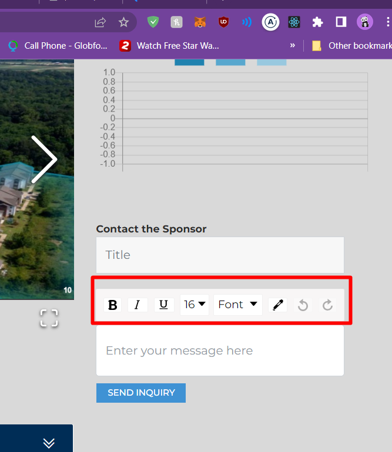

# DigiShares Params Description

This describes the parameters used by the API/Frontend and what their intended use is

---

# Accreditation Parameters

##### IS_ACCREDITATION_ENABLED = `AccreditationEnabled`

- Description: `Allows the Administrators to setup Accreditation processes for the investors`
- Affected Field: `intValue`
- Default Value: `0`
  - Possible Values:
    - 0: `disabled`
    - 1: `enabled`

##### ACCREDITATION_PROVIDER = `AccreditationProvider`

- Description: `Describes the Accreditation provider used by the application`
- Affected Field: `intValue`
- Default Value: `0`
  - Possible Values:
    - 0: `Verify Investor Com`
    - 1: `Accredd`

##### SCHEDULED_EMAIL_NOTIFICATION_TIMER = `scheduledEmailNotificationTimer`

- Description: `The amount of time in minutes we want to wait and then send an Email Notification`
- Affected Field: `intValue`
- Default Value: `10`
  - Possible Values: `Any valid Integer number`

##### ACCREDITATION_REQUIREMENT_STEP = `accreditationRequirementStep`

- Description: `Describes the step at which the Investor is required to pass Accreditation`
- Affected Field: `intValue`
- Default Value: `0`
  - Possible Values:
    - 0: `OnRegister`
    - 1: `OnPurchase`
    - 2: `Ignore`
    - 3: `PrePayment` (Before the payment process starts, but after the document signing has finished)

### Verify Investor Com Parameters

##### VERIFY_INVESTOR_COM_API_TOKEN = `VerifyInvestorComApiToken`

- Description: `Used to authenticate digishares calls on the verify investor com end`
- Affected Field: `stringValue`
- Default Value: ``
  - Possible Values:
    - any string

##### VERIFY_INVESTOR_COM_URL = `verifyInvestorComUrl`

- Description: `Specifies the URL where we can fetch the latest code from verify investor`
- Affected Field: `stringValue`
- Default Value: `{ backendURL: "", frontendURL: "" }`
- Possible Values:
  `{ backendURL: "", frontendURL: "" }`

### Accredd Parameters

##### ACCREDD_LINK = `AccreddRedirectLink`

- Description: `Used by the frontend to link the investor to the Accredd website`
- Affected Field: `stringValue`
- Default Value: ``
  - Possible Values:
    - any string

---

# KYC Parameters

- SUM_SUB_API_JSON = `SumSubApiJson

##### KYC_PROVIDER = `KycProvider`

- Description: `Describes the KYC provider used by the client`
- Affected Field: `intValue`
- Default Value: `0`
  - Possible Values:
    - 0: `Internal`
    - 1: `BlockPass`
    - 2: `SumSub`
    - 3: `Netki`

##### KYC_REQUIREMENT_STEP = `KycRequirementStep`

- Description: `Describes the step at which the Investor is required to pass KYC`
- Affected Field: `intValue`
- Default Value: `0`
  - Possible Values:
    - 0: `OnRegister` (When the investor registers on the platform)
    - 1: `OnPurchase` (When the investor starts any purchase process, be it of shares from the company or trading with eachother)
    - 2: `Ignore`
    - 3: `PrePayment` (Before the payment process starts, but after the document signing has finished)

### Internal

##### IS_DRIVERS_LICENSE_ENABLED = `isDriversLicenseEnabled`

- Description: `Allow Driver's license as a valid ID`
- Affected Field: `intValue`
- Default Value: `0`
- Possible Values:
  - 1: `true`
  - 0: `false`

### Block Pass

##### BLOCK_PASS_API_JSON = `BlockPassApiJson`

- Description: `Integration parameters and secrets to allow the connection to BlockPass`
- Affected Field: `stringValue`
- Default Value: `{"ClientId":"","ApiKey":"", "BlockPassWebhookToken":""}`

### Netki

##### NETKI_PARAM_JSON = `NetkiParamJson`

- Description: `Integration parameters and secrets to allow the connection to Netki`
- Affected Field: `stringValue`
- Default Value:
  `{ "mobileAppPanel": "", "username": "", "password": "", "emailHeader": "", "emailBody": "", "attachMobileAppPanelToEmail": false, "sendEmail": true }`

---

# Document Signing

skipDocumentSignScreen

##### SHARE_PURCHASE_DOCUMENTS_MODE = `sharePurchaseDocumentsMode`

- Description: `Describes the document signing provider`
- Affected Field: `stringValue`
- Default Value: `internal`
- Possible Values:
  - internal
  - docuSign
  - helloSign

##### SKIP_DOCUMENT_SIGN_SCREEN = `skipDocumentSignScreen`

- Description: `Automatically redirect the investors to the next required contract that needs to be signed, when purchasing shares. When turned off, the investors will be able to select the order in which they wish to sign the required contracts`
- Affected Field: `intValue`
- Default Value: `0`
- Possible Values:
  - 1: `true`
  - 0: `false`

### Internal

##### INTERNAL_SIGNATURE_MODE = `internalSignatureMode`

- Description: `Describes the way the investor can sign a document, when documents are handled by the DigiShares`
- Affected Field: `stringValue`
- Default Value: `draw`
- Possible Values:
  - draw
  - checkmark

##### DRAW_SIGNATURE_PREFILL_FONTS = `drawSignaturePrefillFonts`

- Description: `Describes the fonts that are suggested as pre-drawn signature, when the internal signature mode is selected as draw.`
- Affected Field: `stringValue`
- Default Value: `["Cedarville Cursive", "UnifrakturCook"]`
- Possible Values:
  - an array of any of the google fonts

### DocuSign Parameters

##### DOCUSIGN_OAUTH_BASE_PATH = `DocuSignOauthBasePath`

- Description: `Describes the fonts that are suggested as pre-drawn signature, when the internal signature mode is selected as draw.`
- Affected Field: `stringValue`
- Default Value: `["Cedarville Cursive", "UnifrakturCook"]`
- Possible Values:
  - an array of any of the google fonts

##### DOCUSIGN_RSA_KEY = `DocuSignRsaKey`

- Description: `Holds an encrypted version of the RSA key used to connect to the DocuSign servers`
- Affected Field: `stringValue`
- Default Value: ``
- Possible Values:
  - any string

##### DOCUSIGN_USER_ID = `DocuSignUserID`

- Description: `Used for authentication on DocuSign`
- Affected Field: `stringValue`
- Default Value: ``
- Possible Values:
  - any string

##### DOCUSIGN_INTEGRATION_KEY = `DocuSignIntegrationKey`

- Description: `Used for authentication on DocuSign`
- Affected Field: `stringValue`
- Default Value: ``
- Possible Values:
  - any string

##### DOCUSIGN_LINK = `DocuSignlinkToLoginServer`

- Description: `Points to the DocuSign servers`
- Affected Field: `stringValue`
- Default Value: ``
- Possible Values:
  - any string

##### DOCUSIGN_SHARE_PURCHASE_CONTRACT_ID = `DocuSignSharesPurchaseContractID`

- DEPRECATED (used only in multisto for RedSwan)
- Description: `Points to the document template created on DocuSign`
- Affected Field: `stringValue`
- Default Value: unknown
- Possible Values: unknown

##### DOCUSIGN_STO_CONTRACT_ID = `DocuSignSTOContractID`

- DEPRECATED (used only in multisto for RedSwan)
- Description: `Points to the document template created on DocuSign`
- Affected Field: `stringValue`
- Default Value: unknown
- Possible Values: unknown

##### DOCUSIGN_EMAIL = `DocuSignEmail`

- DEPRECATED (no longer used)
- Description: `Stores the Client's email. Used for login purposes`
- Affected Field: `stringValue`
- Default Value: ``
- Possible Values: any string

##### DOCUSIGN_PASSWORD = `DocuSignPassword`

- DEPRECATED (no longer used)
- Description: `Stores the Client's encrypted password. Used for login purposes`
- Affected Field: `stringValue`
- Default Value: ``
- Possible Values: any string

### HelloSign Parameters

##### HELLO_SIGN_API_KEY = `helloSignApiKey`

- Description: `Used for authentication on HelloSign`
- Affected Field: `stringValue`
- Default Value: ``
- Possible Values:
  - any string

##### HELLO_SIGN_TEST_MODE = `helloSignTestMode`

- Description: `Used to denote whether the application can use a free, non-binding version of HelloSign`
- Affected Field: `intValue`
- Default Value: `0`
  - Possible Values:
    - 0: `disabled`
    - 1: `enabled`

---

# Investor Module Switches

##### IS_WALLET_MANAGEMENT_MODULE_ENABLED = `isWalletManagementModuleEnabled`

- Description: `Allows the Investors to navigate to the Wallet Management Module`
- Affected Field: `intValue`
- Default Value: `1`
  - Possible Values:
    - 0: `disabled`
    - 1: `enabled`

##### IS_MY_PORTFOLIO_MODULE_ENABLED = `isMyPortfolioModuleEnabled`

- Description: `Allows the Investors to navigate to the Portfolio Module`
- Affected Field: `intValue`
- Default Value: `1`
  - Possible Values:
    - 0: `disabled`
    - 1: `enabled`

##### IS_ACTIVE_OFFERINGS_MODULE_ENABLED = `isActiveOfferingsModuleEnabled`

- Description: `Allows the Investors to navigate to the Active Offerings/Active Properties Module`
- Affected Field: `intValue`
- Default Value: `1`
  - Possible Values:
    - 0: `disabled`
    - 1: `enabled`

##### IS_NEWS_MODULE_ENABLED = `isNewsModuleEnabled`

- Description: `Allows the Investors to navigate to the News Module`
- Affected Field: `intValue`
- Default Value: `1`
  - Possible Values:
    - 0: `disabled`
    - 1: `enabled`

##### IS_CONTRACT_MODULE_ENABLED = `isContractsModuleEnabled`

- Description: `Allows the Investors to navigate to the Signed Contracts/Documents Module`
- Affected Field: `intValue`
- Default Value: `1`
  - Possible Values:
    - 0: `disabled`
    - 1: `enabled`

##### IS_CORPORATE_ACTIONS_MODULE_ENABLED = `isCorporateActionsModuleEnabled`

- Description: `Allows the Investors to navigate to the Corporate Actions (Meetings/Votes) Module`
- Affected Field: `intValue`
- Default Value: `1`
  - Possible Values:
    - 0: `disabled`
    - 1: `enabled`

##### IS_TRADING_MODULE_ENABLED = `isTradingModuleEnabled`

- Description: `Allows the Investors to navigate to the Trading Module`
- Affected Field: `intValue`
- Default Value: `1`
  - Possible Values:
    - 0: `disabled`
    - 1: `enabled`

##### IS_CHAT_MODULE_ENABLED = `isChatModuleEnabled`

- Description: `Allows the Investors to navigate to the Chat Module`
- Affected Field: `intValue`
- Default Value: `1`
  - Possible Values:
    - 0: `disabled`
    - 1: `enabled`

##### IS_SUPPORT_MODULE_ENABLED = `isSupportModuleEnabled`

- Description: `Allows the Investors to navigate to the Support Module`
- Affected Field: `intValue`
- Default Value: `1`
  - Possible Values:
    - 0: `disabled`
    - 1: `enabled`

##### IS_INVESTOR_OWNERSHIP_MODULE_ENABLED = `isInvestorOwnershipModuleEnabled`

- Description: `Allows the Investors to navigate to the Ownership (investing as a public person/entity) Module`
- Affected Field: `intValue`
- Default Value: `1`
  - Possible Values:
    - 0: `disabled`
    - 1: `enabled`

##### IS_SETTINGS_MODULE_ENABLED = `isSettingsModuleEnabled`

- Description: `Allows the Investors to navigate to the Settings Module`
- Affected Field: `intValue`
- Default Value: `1`
  - Possible Values:
    - 0: `disabled`
    - 1: `enabled`

##### IS_REFERRAL_MODULE_ENABLED = `isTellAFriendModuleEnabled`

- Description: `Allows the Investors to navigate to the Referral Module`
- Affected Field: `intValue`
- Default Value: `1`
  - Possible Values:
    - 0: `disabled`
    - 1: `enabled`

##### IS_ACCREDITATION_MODULE_ENABLED = `isAccreditationModuleEnabled`

- Description: `Allows the Investors to navigate to the Accreditation Module`
- Affected Field: `intValue`
- Default Value: `1`
  - Possible Values:
    - 0: `disabled`
    - 1: `enabled`

---

# Automation

##### DO_AUTOMATIC_BLOCKCHAIN_TRANSACTION_CHECKS = `doAutomaticBlockchainTransactionChecks`

- Description: `Allow the Platform to automatically check if blockchain deposits have been realized`
- Affected Field: `intValue`
- Default Value: `0`
  - Possible Values:
    - 0: `disabled`
    - 1: `enabled`

##### DO_AUTOMATIC_PURCHASE = `doAutomaticPurchase`

- Description: `Allows the Platform to automatically handle share purchases (removing the STO admin step)`
- Affected Field: `intValue`
- Default Value: `0`
  - Possible Values:
    - 0: `disabled`
    - 1: `enabled`

##### DO_AUTOMATIC_SELLBACK = `doAutomaticSellBack`

- Description: `Allows the Platform to automatically handle the sell back of shares (removing the STO admin step)`
- Affected Field: `intValue`
- Default Value: `0`
  - Possible Values:
    - 0: `disabled`
    - 1: `enabled`

---

# SSO

##### SSO_MODE_ENABLED = `SSOModeEnabled`

##### SSO_REDIRECT_URL = `SSORedirectFrontEnd`

---

# Platform UI Customization

##### LEFT_SIDE_MENU_FONT = `leftSideMenuFont`

- Description: `Changes the font of the left side menu panel on frontend (react only)`
- Affected Field: `stringValue`
- Default Value: ``
  - Possible Values:
    - any google font

##### POWERED_BY_LABEL = `poweredByLabel`

- Description: `Changes the way the "powered by laber" looks like. Supports HTML formatting`
- Affected Field: `stringValue`
- Default Value: `powered by DigiShares`
  - Possible Values:
    - any string/HTML

---

# Ravencoin

##### RAVENCOIN_USETWALLETPASSWORD = `Ravencoin_UserWalletPassword`

// TODO

##### RAVENCOIN_SERVERURL = `Ravencoin_ServerURL`

// TODO

##### RAVENCOIN_USERNAME = `Ravencoin_Username`

// TODO

##### RAVENCOIN_PASSWORD = `Ravencoin_Password`

// TODO

---

# Others

IS_INVESTMENT_RETURN_CALCULATION_ENABLED = `isInvestmentReturnCalculationEnabled`

- Description: `Turns on calculation required by MarketSpace.`
- Affected Field: `intValue`
- Default Value: `0`
  - Possible Values:
    - 0: `disabled`
    - 1: `enabled`

##### IS_INVOICING_ENABLED = `isInvoicingEnabled`

- Description: `Turns on invoicing payment. This flow will generate invoices after every shares purchase. The investor can use the invoice to send bank transfers to the project managers.`
- Affected Field: `intValue`
- Default Value: `0`
  - Possible Values:
    - 0: `disabled`
    - 1: `enabled`

##### INVESTOR_DASHBOARD_THEME = `investorDashboardTheme`

// TODO

##### IS_MARKET_SPACE = `IsMarketSpace`

- Description: `Turns on MarketSpace specific UI and functionality`
- Affected Field: `intValue`
- Default Value: `0`
  - Possible Values:
    - 0: `disabled`
    - 1: `enabled`

##### CUSTODIAN_NAME = `CustodianName`

// TODO

##### POLYGON_WEB3_ADDRESS = `polygonWeb3Address`

// TODO

##### BINANCE_WEB3_ADDRESS = `binanceWeb3Address`

// TODO

##### WEB3_ADDRESS = `web3Address`

// TODO

##### ARE_HOST_NAMES_ENABLED = `areSTOHostnamesEnabled`

// TODO

##### MOONPAY_CONFIG = `MoonpayConfig`

// TODO

##### INTERNAL_WALLET_MODE = `investorInternalWalletProjectSpecific`

- Description: `Switches the way the platform treats wallets. The global setting forces all transactions to use STO0's wallets`
- Affected Field: `intValue`
- Default Value: `2`
- Possible Values:
  - 1: `StoSpecific`
  - 2: `Global`
  - 3: `Disabled`

##### IS_SMTP_SSL3_ENABLED = `SMTP_SSL3`

- Description: `Makes the Mailer use SSL3 for authenticating on the SMTP server.`
- NOTE: to be turned on for Office365-like only. Gmail will not work with ssl3
- Affected Field: `intValue`
- Default Value: `0`
  - Possible Values:
    - 0: `disabled`
    - 1: `enabled`

##### CLIENT_KYC = `clientKYC`

// TODO

##### IS_2FA_ENABLED_BY_DEFAULT = `is2FAEnabledByDefault`

- Description: `Turns on 2FA for every new Investor sign-up`
- Affected Field: `intValue`
- Default Value: `0`
  - Possible Values:
    - 0: `disabled`
    - 1: `enabled`

##### WHITELISTED_CORS_URLS = `whitelistedCorsUrls`

//TODO

##### IS_CLOUD_STORAGE_ENABLED = `isCloudStorageEnabled`

- Description: `Depending its value, Admin can decide where files are going to be saved : Local Server or Cloud Storage`
- Affected Field: `intValue`
- Default Value: `0`
  - Possible Values:
    - 0: `disabled`
    - 1: `enabled`

##### IS_PROPERTY_SORTING_ENABLED = `isPropertySortingEnabled`

- Description: `Allows the Investors to sort STOs on their active offerings page`
- Affected Field: `intValue`
- Default Value: `0`
  - Possible Values:
    - 0: `disabled`
    - 1: `enabled`

#### ATOMIC_SWAP_CONTRACT_ADDRESS = `atomicSwapContractAddress`

- Description: `Used for connecting to the deployed atomic swap contract regarding tokenized shares`
- Affected Field: `stringValue`
- Default Value: ``
- Possible Values:
  - any string

#### TERMS_AND_CONDITIONS_CONFIG = `termsAndConditionsConfig`

- Description: `Used for the Terms and Conditions link on the investor registration screen.`
- Affected Field: `stringValue`
- Default Value: `{"link": "https://digishares.io/tc","text": "Terms of Service of DigiShares"}`
- Possible Values:
  - {link: url to T&C page, text: text of the link} .

##### IS_CONTACT_THE_SPONSOR_FONT_ENABLED = `isContactTheSponsorFontSwitchEnabled`

- Description: `Displays or Hides the following UI element`
  
- Affected Field: `intValue`
- Default Value: `1`
  - Possible Values:
    - 0: `disabled`
    - 1: `enabled`

##### IS_BANK_DETAILS_ENABLED = `isBankDetailsSwitchEnabled`

- Description: `Displays or hides the bank details for investors in the settings menu`
- Affected Field: `intValue`
- Default Value: `1`
  - Possible Values:
    - 0: `disabled`
    - 1: `enabled`

##### IS_BLOCKCHAIN_ADDRESS_ENABLED = `isBlockchainAddressSwitchEnabled`

- Description: `Displays or hides the shared blockchain address details for investors in the settings menu`
- Affected Field: `intValue`
- Default Value: `1`
  - Possible Values:
    - 0: `disabled`
    - 1: `enabled`

##### PLATFORM_CONFIGURATION = `platformConfiguration`

- Description: `Switches the way the platform functions. For more details see platform admin -> settings -> platform configuration screen.`
- Affected Field: `intValue`
- Default Value: `1`
- Possible Values:
  - 1: `wallet based (crypto only)`
  - 2: `account based (fiat only)`
  - 3: `custody based (both, but with internal balances)`

##### TOGGLE_THEME_EDITOR = `toggleThemeEditor`

- Description: `Switches the theme modifier on or off for the investor frontend.`
- Affected Field: `intValue`
- Default Value: `1`
  - Possible Values:
    - 0: `disabled`
    - 1: `enabled`

#### selectedTokenStudio

- Description: `Holds array of selected blockchain ids where platform shoud focus on`
- Affected Field: `stringValue`
- Default Value: `[]`
- POssible values:
- ids` from blockchains table

#### DEFAULT_PROJECT_TYPE = `defaultProjectType`

- Description: `Enforces platform Admin select only defualt option while creating new project`
- Affected Field: `intValue`
- Default Value: `1`
- Possible Values:
  - 1: `tokenized only`
  - 2: `non-tokenized only`
  - 3: `combined`

#### IS_PRIVATE_MODULE_ENABLED = `isPrivateModuleEnabled`

- Description: `Switches the Private Key link on/off for platform admin sidebar`
- Affected Field: `intValue`
- Default Value: `1`
  - Possible Values:
    - 0: `disabled`
    - 1: `enabled`

##### DEFAULT_CURRENCY_TYPE = `defaultCurrencyType`

- Description: `Shows currencies on platform admin -> manage currencies screen based on value.`
- Affected Field: `intValue`
- Default Value: `3`
- Possible Values:
  - 1: `fiat only`
  - 2: `crypto only`
  - 3: `combined`

#### ALLOW_INVESTORS_TO_REGISTER = `allowInvestorsToRegister`

- Description: `Allows new investors to register on the platform. Also toggels the display of the registration component on the registration page`
- Affected Field: `intValue`
- Default Value: `1`
  - Possible Values:
    - 0: `disabled`
    - 1: `enabled`

#### HIDE_CONTRACTS_TIL_POST_PURCHASE = `hideContractsTilPostPurchase`

- Description: `Hide the contracts that the investor has signed, untill the share purchase get's approved by the administrators`
- Affected Field: `intValue`
- Default Value: `0`
  - Possible Values:
    - 0: `disabled`
    - 1: `enabled`

#### ENABLE_PLATFORM_CONFIGURATION_SWITCHES= `enablePlatformConfigurationSwitches`

- Description: `Allow the platform admin to edit the switches within the platform configuration`
- Affected Field: `intValue`
- Default Value: `0`
  - Possible Values:
    - 0: `disabled`
    - 1: `enabled`

#### IS_AUTOMATIC_SHARE_CLASS_SETTINGS_ENABLED = `isAutomaticShareClassSettingsEnabled`

- Description: `display section of Automatic Share class on project list => project -> shares -> Edit`
- Affected Field: `intValue`
- Default Value: `1`
  - Possible Values:
    - 0: `disabled`
    - 1: `enabled`

#### IS_INTERNAL_TOKENIZED_PURCHASE_ENABLED = `isInternalTokenizedPurchaseEnabled`

- Description: `display section of Automatic Share class on project list => project -> shares -> Edit`
- Affected Field: `intValue`
- Default Value: `0`
  - Possible Values:
    - 0: `disabled`
    - 1: `enabled`

#### IS_HTTPS_START_ENABLED = `LocalHttpsStart`

- Description: `NOTE: use this only on local machines. Enable MultiSTO Admin panel to start in HTTPS mode`
- Affected Field: `intValue`
- Default Value: `0`
  - Possible Values:
    - 0: `disabled`
    - 1: `enabled`

#### IS_ALL_DOCS_SIGNED_POP_UP_ENABLED = `isAllDocumentsSignedPopUpEnabled`

- Description: `Hide the pop up for when all documents have been signed in the investor side.`
- Affected Field: `intValue`
- Default Value: `0`
  - Possible Values:
    - 0: `disabled`
    - 1: `enabled`

#### IS_MERGING_PAYMENTS_SHARES_REQUESTS_ENABLED = `isAllDocumentsSignedPopUpEnabled`

- Description: `Merge Purchase Requests with their own Invoices on the investor dashboard. The user can click "review" to view the invoice or delete to delete both invoice and purchase request.`
- Affected Field: `intValue`
- Default Value: `0`
  - Possible Values:
    - 0: `disabled`
    - 1: `enabled`

### IS_SHARE_TRANSFER_EMAIL_ENABLED = `isShareTransferEnabled`

- Description: `Notify investor when he is involved in a successful share tranfser via email`
- Affected Field: `intValue`
- Default Value: `1`
  - Possible Values:
    - 0: `disabled`
    - 1: `enabled`
